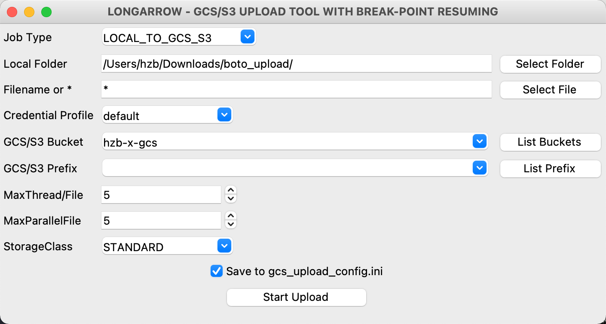

# Cloud Storage Multipart Resume Upload Tool (云对象存储多线程断点续传)   

Muliti-thread with multi-part Cloud Storage upload tool, breaking-point resume supported, suitable for large files in parallel, support GCS/S3/OSS and others S3 compitable API  
对象存储多线程断点续传，适合大批量的大文件传输，支持谷歌GCS/AWS S3/阿里OSS等各种S3兼容接口  

### Features:  
具体功能包括：  

* Split multipart and get from source, multi-thread upload to GCS/S3 and merge, support resume upload (Part level).   
源文件的自动分片获取，多线程并发上传到目的GCS/S3再合并文件，断点续传(分片级别)。  

* Support source: local files, Google Cloud Storage, Amazon S3, AliCloud OSS and any other S3 compatible API  
支持的源：本地文件、谷歌Cloud Storage、Amazon S3、阿里云 OSS 和其他S3兼容接口  

* Support destination: Google Cloud Storage, Amazon S3, 和其他S3兼容接口  
支持的目的地：谷歌Cloud Storage、Amazon S3、和其他S3兼容接口  

* Multi-files concurrently transmission and each file multi-threads download and upload.    
多文件并发传输，且每个文件再多线程并发传输，充分压榨带宽。S3_TO_S3 或 ALIOSS_TO_S3 中间只过中转服务器的内存，不落盘，节省时间和存储。  

* Auto-retry, progressive increase put off, auto-resume upload parts, MD5 verification on S3  
网络超时自动多次重传。重试采用递增延迟，延迟间隔=次数*5秒。程序中断重启后自动查询S3上已有分片，断点续传(分片级别)。每个分片上传都在S3端进行MD5校验，每个文件上传完进行分片合并时可选再进行一次S3的MD5与本地进行二次校验，保证可靠传输。  

* Auto iterate subfolders, and can also specify only one file.  
自动遍历下级子目录，也可以指定单一文件拷贝。  

* Support setup storage class: 'STANDARD', 'NEARLINE', 'COLDLINE', 'ARCHIVE', 'REDUCED_REDUNDANCY', 'STANDARD_IA', 'ONEZONE_IA', 'INTELLIGENT_TIERING', 'GLACIER', 'DEEP_ARCHIVE'   
可设置存储级别，如：'STANDARD', 'NEARLINE', 'COLDLINE', 'ARCHIVE', 'REDUCED_REDUNDANCY', 'STANDARD_IA', 'ONEZONE_IA', 'INTELLIGENT_TIERING', 'GLACIER', 'DEEP_ARCHIVE'   

* Support GUI and Package exe for Windows user  
可启动图形界面。并且已经打包了 exe 文件供 Windows 用户使用，无需安装 python 或依赖包。  

* Can setup ouput info level  
可设置输出消息级别，如设置WARNING级别，则只输出你最关注的信息。
--------  
## Architecture
  


## Installation  安装  

### Install Python3 & SDK (boto3)
1. Install [Python](https://www.python.org/downloads/) 3.6 or above  
  

2. Install SDK [boto3](https://github.com/boto/boto3)    
```bash
    pip install -r requirements.txt --user
```


## Quick Start 快速使用  
```bash
python3 s3_upload.py --gui
```
Run above command. If you haven't input any HMAC key, then follow the hints to input Access_key/Secret:    
用以上命令启动应用程序，如果没有设置过HMAC密钥，则按提示输入密钥 Access_key/Secret 如下图:    

On GUI, select local directory and target Bucket/Prefix, parallel upload file and concurrent threads per file.   
在图形界面上，选择要上传的本地目录和目标Bucket/Prefix，并行文件数量，每个文件并发数量等。  

Click "Start Upload" to start.  

[win_exe_package](./win_exe_package) is ready for Windows customer, and no need to install python.   
Windows 绿色安装，解压并运行exe文件即可，不需要另外再装Python等依赖。  

## Detail Setup 详细设置  
### Setup Credential  

1. Credential  
You need to make sure the credentials you're using have the correct permissions to access the storage
service. If you run into 'Access Denied' errors while running this sample, please follow the steps below.  
确认你的 IAM user 有权限访问对应的对象存储.  

* Google Cloud: Login to the Google Cloud Storage Console -> Setting -> Interoperability, Download a Service Account HMAC key or User Account HMAC key   
在GCP GCS控制台 -> 设置 -> 互操作性 中下载 服务账号 HMAC 密钥或者用户账号 HMAC 密钥

* AWS: Login to the [AWS IAM Console](https://console.aws.amazon.com/iam/home) Navigate to the Users page. Find the AWS IAM user whose credentials you're using. Under the 'Permissions' section, attach the policy called 'AmazonS3FullAccess'   
在AWS IAM控制台上下载 IAM 密钥   

* Copy aws_access_key_id and aws_secret_access_key of this user for below setting

* Create file `"credentials"` in ~/.aws/ (`C:\Users\USER_NAME\.aws\` for Windows users) and save below content:   
创建文件名为 `"credentials"` 于 ~/.aws/ 目录(`C:\Users\USER_NAME\.aws\` for Windows users) 并保存以下内容:
```
[default]
aws_access_key_id = <your access key id>
aws_secret_access_key = <your secret key>
```
* If S3_TO_S3 mode, you need two profile for source and destination S3  
如果是S3 copy to S3你需要配置两个 profile，以便访问源和目的S3  
See the [AWS document Security Credentials](http://aws.amazon.com/security-credentials) page for more detail  
For example：
```
[gcs]
aws_access_key_id=XXXXXXXXXXXXXXX
aws_secret_access_key=XXXXXXXXXXXXXXXXXXXXXX

[aws]
aws_access_key_id=XXXXXXXXXXXXXXX
aws_secret_access_key=XXXXXXXXXXXXXXXXXXXXXX
```

2. If ALIOSS_TO_S3 mode, setup AliCloud credentials in s3_upload_config.ini  
```
ali_SrcBucket = "your bucket name"  # 阿里云OSS 源Bucket，对于 LOCAL_TO_S3/S3_TO_S3 则本字段无效
ali_access_key_id = "xxxxxxxxxxx"  # 阿里云 RAM 用户访问密钥
ali_access_key_secret = "xxxxxxxxxxxx"
ali_endpoint = "oss-cn-beijing.aliyuncs.com"  # OSS 区域 endpoint，在OSS控制台界面可以找到
```

## UPLOAD Application Configure - UPLOAD 应用配置
**For local UPLOAD to S3, you can run with GUI and config on GUI: python3 s3_upload.py --gui**  
**如果是本地上传，运行图形界面模式，你可以直接在界面做这些应用设置: python3 s3_upload.py --gui**  
### Config `s3_upload_config.ini`
* 上面配置的 profile name 填入对应源和目的 profile name 项，例如：  
```
SrcProfileName = aws
DesProfileName = gcp
```
* Setup Job Type  
'LOCAL_TO_S3' or 'S3_TO_S3' or 'ALIOSS_TO_S3'   
```
JobType = LOCAL_TO_S3
```
* Setup folder, destination buckets and other optional config  
设置源文件路径和上传S3，以及其他可选配置  

## Start the UPLOAD app - 运行上传应用
* Python3 Environment and don't want to run with GUI, Linux/MacOS/Win  
Python3 环境，且不需要GUI界面，运行在 Linux/MacOS/Win
```bash
python3 s3_upload.py --nogui
```

* Python3 Environment and run with GUI. Linux/MacOS/Win  
Python3 环境，且带GUI界面，运行在 Linux/MacOS/Win：
```bash
python3 s3_upload.py --gui
```

部分 MacOS 版本的 Python 运行 GUI（ tkinter ）会出现 Mac WindowServer 端口冲突，导致 Mac 退出用户重新启动的情况。目前受限于 Python tkinter 与 MacOS，遇到这种情况，需要升级或降级 Python/tkinter 解决。参考：  
https://bugs.python.org/issue37833  
https://stackoverflow.com/questions/57400301/how-to-fix-tkinter-every-code-with-gui-crashes-mac-os-with-respring    
或不带 GUI 来运行 python3 s3_upload.py --nogui。Windows 操作系统没有反馈有该问题。  

### 实现中国大陆较稳定地网络访问GCS
* 指定就近API地址。中国大陆可以直接访问到 GCS API(google cloud storage)，但很可能会解析到美国的API入口，本地 ping storage.googleapis.com 即可看到解析到哪个地址，以及时延。可以利用GCS API 全球分布的特性，在就近例如香港服务器上解析一个 nslookup storage.googleapis.com 的IP地址，然后写入到本地HOST文件中，以实现就近访问，加速上传。注：API所在地跟Bucket所在区域并无必然关联，就近访问API可以利用GCP骨干网的优势。正常情况访问API是会自动调度到就近的入口的，但中国大陆情况特殊。  
HOST文件示例如下：   
```
sudo vi /etc/hosts
    <Specified_GCS_IP> storage.googleapis.com
```
* 启用TCP BBR。本地服务器启用TCP BBR拥塞管理协议可以更充分地利用带宽进行上传。

### NOTICE  注意:  
* Server memory: MaxThread x MaxParallelFile x Chunksize is the temp memory needed for transmission  
服务器内存： MaxThread x MaxParallelFile x Chunksize 是传输过程中需要占用的临时内存数  

* While same file prefix/name with same size, it will be considered as duplicated file and this file will be ignore.
This is a trade-off for performance. It might be improved in the coming release, with Verification Option.  
相同的文件前缀和文件名，并且文件大小相同的，则会被认为是重复文件不再传输。  

* S3 only support 10,000 parts for one single file. Now the application can auto tuning Chunksize for big file, you don't need to change it manually.  
If you need to change ChunkSize when files are transmitting, please stop application and restart, then select "CLEAN unfinished upload". Application will clean and re-upload all unfinished files.   
由于 S3 API 最大只支持单文件10,000个分片。目前程序已经有自动调整 ChunkSize 机制，无需人工干预。  
如果某个文件传输到一半，要修改 ChunkSize 的话。请中断，然后在启动时选择CLEAN unfinished upload，程序会清除未完成文件，并重新上传整个文件，否则文件断点会不正确。  

* S3_TO_S3 Senario, there is only one Prefix in config, source and destination S3 bucekt are the same prefix. If you need more flexible prefix setting, please use s3_migrate Cluster or Serverless version.  
S3_TO_S3 场景，配置中只做了一个 Prefix 设置项，源和目的S3 Bucket都是相同的 Prefix。如果需要更灵活的设置，请使用s3_migrate集群或无服务器版本。   

* S3_TO_S3 Senario, it doesn't support source bucket S3 Version Control, but only get the lastest version of object from S3. Don't change the original file while copying. If you need to support S3 Versioning, please use s3_migrate Cluster or Serverless version 
S3_TO_S3 场景，本项目不支持源桶 S3 版本控制，相同对象的不同版本是只访问对象的最新版本，而忽略掉版本ID。即如果启用了版本控制，也只会读取S3相同对象的最后版本。目前实现方式不对版本做检测，也就是说如果传输一个文件的过程中，源文件更新了，会到导致最终文件出错。如果需要支持 S3 版本控制，请使用s3_migrate集群或无服务器版本。  

* LOCAL_TO_S3 Senario, if you replace the source file while transmission, that will break the integrity of the file. While all file transmitted, application will compare file size, found unmatch, and report this case at the end.   
If you don't want to see this case happen, you should enable ifverifymd5 = True , application will re-read the local file to calculate MD5 and compare with S3 Etag on every file complete transmisson. If it is not match, it will re-transmit.  
LOCAL_TO_S3 场景，如果你在传输某个文件过程中覆盖了源文件，则文件完整性会被破坏，到所有文件传输结束后再对比的时候会发现文件Size不一致，并报告出来。  
如果希望防止这种情况，应该启用 ifverifymd5 = True ，则会在传输完单个文件的时候，重新读取本地文件并计算MD5与S3上的Etag做对比，不一致则会重新传输。

* 此处没有使用阿里云OSS的S3兼容接口，而是使用OSS原生接口，主要是OSS不支持S3接口的path路径，而要改VirtualHost模式
如果需要从阿里云OSS拷贝，则还需要安装阿里 SDK [oss2](https://github.com/aliyun/aliyun-oss-python-sdk)

## License

This library is licensed under the MIT-0 License. See the LICENSE file.
