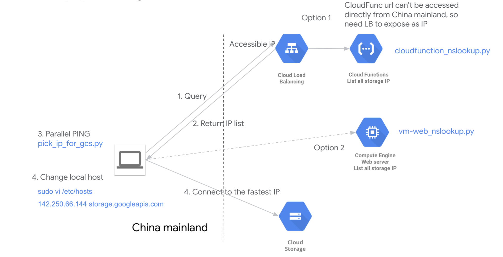
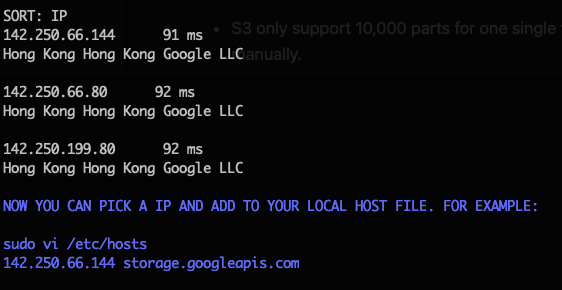

## 实现中国大陆较稳定地网络访问 GCS
指定就近的 GCS 地址，本工具提供一个小的辅助工具帮你找到最快的 GCS 地址，从中国访问比默认地址快。  

中国大陆可以直接访问到 GCS API(google cloud storage)，但中国的DNS会解析到美国的API入口。  
可以利用 GCS API 全球分布的特性，在就近（例如香港的服务器）解析 storage.googleapis.com 的IP地址，然后写入到本地HOST文件中，以实现就近访问，加速上传。  
注：API所在地跟Bucket所在区域并无必然关联，就近访问API可以利用GCP骨干网的优势，访问任何地区的GCS。正常情况访问API是会自动调度到就近的入口的，但中国大陆情况特殊，所以自己控制IP可以加速。    
本项目提供了两个工具，帮你快速找到最快的IP   
1. 部署在云上（例如香港）的Cloud Function云函数服务 [cloudfunction_nslookup.py](./cloudfunction_nslookup.py) 访问即返回当地解析 storage.googleapis.com 的地址列表。考虑到大陆可能不能直接访问 Cloud Function 接口，可以在 Cloud Function 前面部署一个负载均衡，这样可以只访问这个负载均衡的IP。即：  
Local --> Loadbalancer IP --> CloudFunction(HK)  
IP List <-- CloudFunction(resolve storage IP List)  
如果你不想用 CloudFunction+LB，也可以用一个小服务器提供查询服务，web 服务代码：[vm-web_nslookup.py](./tools/vm-web_nslookup.py)
  

2. 在本地同时 ping 所有 GCS IP ，返回速度最快的3个和它对应地理位置 [pick_ip_for_gcs.py](./pick_ip_for_gcs.py)    
Ping 所用到的地址列表包括本地解析出来的，以及从云上 Cloud Function 获取到的远程解析。支持获取多个地区的 Cloud Function 的响应。因应网络变化，以及时间不同，IP时延会变化，所以时不时需要运行一下，更新最佳IP。**运行之前，请先替换代码中 query_endpoints 为你在上一步创建的查询入口 IP。**  
Local ping --> All GCS IPs  
  
修改本地 HOST 文件示例如下：   
    ```
    sudo vi /etc/hosts
    142.250.66.144 storage.googleapis.com
    ```